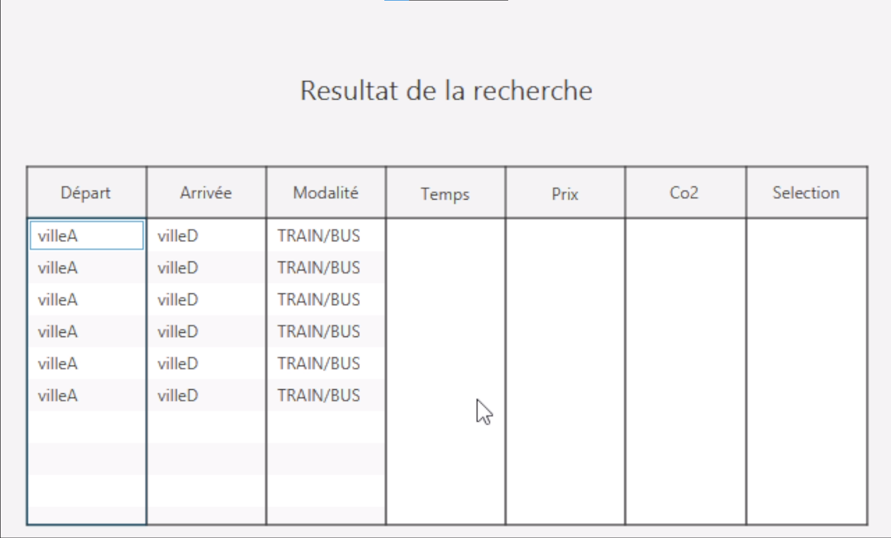

# SAE S2.02 - Rapport pour la ressource IHM

*De Hugo DEBUYSER, Gaël Dierynck, Maxence Antoine, groupe F8*
___

# Introduction
Dans le cadre de notre projet, nous avons développé une interface homme-machine (IHM) pour faciliter l'interaction des utilisateurs avec notre application. L'IHM est située dans le répertoire `src/ihm` et joue un rôle crucial dans la convivialité et l'expérience utilisateur de notre application.

## Architecture de l'IHM
L'architecture de l'IHM est basée sur le modèle MC (Modèle-Contrôleur). Le répertoire `src/ihm` contient les fichiers suivants :

1. `FXMLdemo.java` : Ce fichier contient le FXML reader qui définit le modèle de données utilisé par l'IHM.
2. `MonController.java` : Ce fichier contient les classes qui définissent les contrôleurs de l'IHM, responsables de la gestion des interactions utilisateur et de la mise à jour du modèle et de la vue en conséquence.

[Lien vers le gitlab](https://gitlab.univ-lille.fr/sae2.01-2.02/2024/F8)

Commit : https://gitlab.univ-lille.fr/sae2.01-2.02/2024/F8/-/commit/1c747c0c73fd97a060dadb1424b04756a78b0a36

## Prototypage

 

## Résultat final

## Justification de nos choix

Afin d'optimiser l'expérience utilisateur et de rendre différentes étapes de notre application simple, nous avons décidé de structurer notre interface en trois pages distinctes. Cela permet de ne pas surcharger l'utilisateur, assurent de manière claire chaque étape du processus.

### Page Principale

 

Pour faciliter la sélection des destinations de départ et d'arrivée, nous avons créé deux listes déroulantes alignées horizontalement en haut de l'écran. L'utilisateur peut facilement choisir son point de départ et sa destination finale à partir de ces listes. Nous avons ajouté des zones opposées horizontalement avec des cases à cocher permettant à l'utilisateur de spécifier ses préférences de transport (train, bus, avion). Pour affiner la recherche, des champs de saisie permettent de définir les critères de temps, de dépense en CO2 et de prix. Enfin, un bouton "Rechercher" placé entre les deux filtres expliquer précédemment et permet de lancer la recherche d'itinéraires en fonction des critères définis.

### Résultats de la recherche

 

Une fois la recherche lancée, les résultats sont affichés sous forme de tableau. Ce tableau présente les différents itinéraires trouvés, avec des colonnes détaillant le départ, l'arrivée, les modes de transport utilisés, la durée du trajet, le prix et la dépense en CO2 pour chaque itinéraire. Chaque chemin est cliquable et comporte un bouton de sélection, permettant à l'utilisateur d'examiner les options disponibles et de choisir l'itinéraire qui répond le mieux à ses besoins.

### Sélection et confirmation d'un chemin

 

Après avoir sélectionné un chemin dans le tableau des résultats, les détails de l'itinéraire choisi sont affichés de manière plus approfondie. Ces détails incluent les éventuels changements de transport et les différents points d'intersection. Cette vue détaillée aide l'utilisateur à mieux comprendre le trajet proposé. Enfin, des boutons "Confirmer" et "Annuler" sont disponibles en bas de l'écran, permettant à l'utilisateur de valider ou de rejeter l'itinéraire sélectionné.

___

*Charge de travail :* 
- La page d'accueil est conçu pour être simple et claire avec les éléments nécessaire mis à disposition de l'utilisateur.
- Les éléments similaire et le menu symétrique permettent à l'utilisateur de rapidement comprendre ce qui lui est demandé.
- Les différents libellés et séparateurs aide l'utilisateur à prendre en main l'utilisation de chaque éléments.

*Disposition des éléments :*
- Les éléments les plus importants sont mis en valeur grâce à différents libellés ou mis en valeur (bouton en couleur).
- Les différents séparateurs permettent à l'utilisateur de différencier les élements des autres et de regrouper ce qui va ensemble.
- Utilisation de VBox et Hbox pour ordonner plus facilement les éléments.

*Théorie de la Gestalt :*
- Les éléments relatifs à une tâche spécifique sont regroupés ensemble. Par exemple, les listes déroulantes pour les destinations de départ et d'arrivée sont positionnées côte à côte en haut de l'écran. De même, les cases à cocher pour les modalités de transport (Train, Bus, Avion) sont groupées dans une même zone.
-  Les éléments similaires en termes de fonctionnalité et d'apparence sont utilisés pour indiquer des catégories similaires. Par exemple, les champs de texte pour entrer les filtres de temps, de CO2 et de prix sont similaires en apparence et sont alignés verticalement pour indiquer leur fonction commune de filtrage.
-  L'agencement linéaire des listes déroulantes et des cases à cocher suit une ligne continue qui aide l'utilisateur à naviguer visuellement l'interface sans interruptions.
-  Les bordures autour des éléments comme les panneaux et les zones de saisie aident les utilisateurs à percevoir les groupes d'éléments comme des ensembles distincts.
-  Les boutons de notre projet sont correctement nommés et explicites quant à l'action qu'ils réalisent. Par exemple pour les préférences de filtres, l'utilisation des unités universelle pour chaque valeur permet à l'utilisateur de comprendre simplement quel action y est associée.

___

## Contributions de chaque membre du groupe

Tout au long de ce projet, nous avons soigneusement réfléchi à l'agencement des différents éléments et à la direction que nous allions prendre. Ensemble, nous avons conçu une interface aussi ergonomique que possible pour un utilisateur novice. Notre objectif était que l'utilisateur comprenne rapidement ce qu'il doit faire pour obtenir ce qu'il souhaite.

Nous nous sommes tous les trois occupés du prototypage de l'interface en échangeant régulièrement sur ce qu'il fallait faire ou non. Maxence a ainsi pris en charge la réalisation de notre vision. Hugo et Gaël ont travaillé à transcrire au mieux cette vision à l'aide de Scene Builder. 

Cependant, nous avons parfois rencontré des difficultés pour mettre en place certaines fonctionnalités.
Par exemple, le filtre concernant les chemins (temps, prix etc) ne fonctionne pas et seul le prix est affiché qui est le cout du chemin.
Cela est dût en partie par manque de temps et par un manque de cohérence avec ce qui est possible dans la partie POO.
Il aurait été possible d'ajouter les autres fonctionnalité, mais faute de temps.
