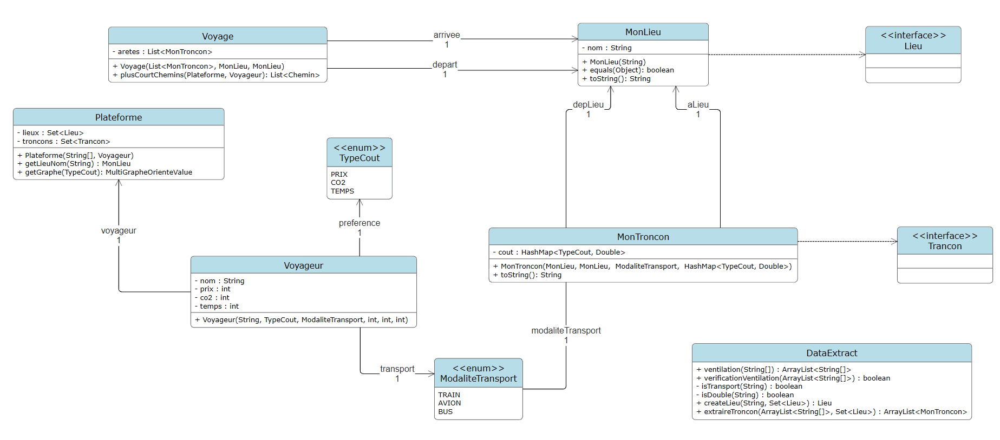
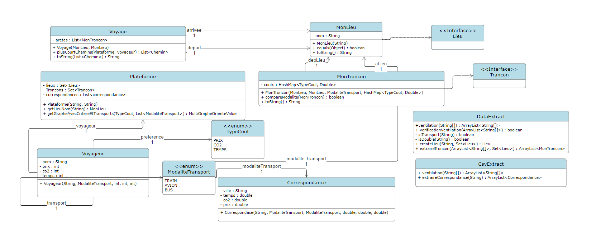
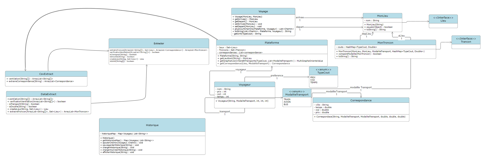

# SAE S2.02 - Rapport pour la ressource Dev-OO

 *De Hugo DEBUYSER, Gaël Dierynck, Maxence Antoine, groupe F*
___

Avant de lancer quoique ce soit, veillez à mettre les chemins contenue dans les fichiers launch.json et settings.json en raccord avec les vôtres. 

___
## Version 1 : Un seul moyen de transport

#### Dans cette première version, il fallait faire la base du programme de cette saé : Calculer un itinéraire optimal entre deux villes, avec une seule modalité de transport et un seul type de ligne. Pour plus de renseignements, rendez vous sur le rapport de la partie ***Graphes***.
---

Notre code se décompose en 9 classes et 4 classes de test. 

1 - L'énumération `TypeCout`
    
L'énumération TypeCout.java permet de d'énumerer par le type TypeCout la contrainte du **Prix**, du **Temps** et du **CO2** émis. 

&nbsp; 

2 - La classe `MonLieu` 

    La Classe MonLieu.java permet de décrire un lieu utilisé pour un potentiel transport. 

Son seul attribut est  `String Nom`, qui naturellement, donne un nom au lieu. 

La classe fournit un comparatateur d'objets MonLieu avec `boolean equals(Object Obj)`
    Elle compare un Object MonLieu avec un other MonLieu. 

&nbsp; 

3 - La classe `Voyageur`

    La classe Voyageur.java permet de décrire un voyageur avec un nom, une préférence de modalité entre le coût, les émissions de CO2, le temps et un moyen de transport.

Ses attributs sont : 
`String Nom`
`TypeCout preference`
`ModaliteTransport transport`
`int prix` `int co2` `int temps`

&nbsp; 

4 - La classe `MonTroncon`

    Cette classe permet de décrire un tronçon de transport avec un lieu de départ, d'arrivée, une modalité de transport et un coût.
Ses attributs sont : 
`MonLieu depLieu` `MonLieu aLieu` ` ModaliteTransport modaliteTransport` ` HashMap<TypeCout , Double> cout`

&nbsp; 

5 - La classe `Voyage`

    La classe Voyage.java décrit un voyage avec son arrivée, son départ et les arêtes présentes(lien avec Graphes). Cette classe utilise l'algorithme KPCC fourni par la librairie de la saé.
La fonction `PlusCourtChemins` liste les PCC selon les critères donnés et calcule l'ensemble des chemins disponibles, en supprimant ceux qui ne sont pas dans les critères.
Ses attributs sont : 
`List<MonTroncon> aretes` `MonLieu arrivee` `MonLieu depart`  

&nbsp; 

6 - La classe `Plateforme`

    La classe Plateforme.java représente une plateforme de transport avec un Lieu, ses tronçons ainsi que le voyageur type. Elle retourne le graphe correspondant aux critères demandés par l'utilisateur. 
Ses attributs sont : 
`Set<Lieu> Lieux` `Set<Trancon> troncons` `Voyageur voyageur`

&nbsp; 

7 - La classe `DataExtract`

    La classe DataExtract.java est, comme son nom l'indique, une classe pour l'extraction de données. Elle ventile les données pour qu'elles soient obligatoirement dans un format correct pour une future utilisation.

___

## Version 2 : Multi-modalité et coût supplémentaire

#### Pour cette version, l'utilisateur peut maintenant choisir plusieurs moyens de transport (Ex. Moitié du trajet en train puis en bus). Les modalités de l'utilisateur restent toujours la priorité dans le calcul de l'itinéraire. Mais cette fois-ci, nous devrons nous préprarer ajouter un coût supplémentaire pour chaque changement de transport.
#### Un maquettage d'interface humain-machine est aussi réalisé.
___ 

Notre code se décompose en 2 nouvelles classes et quelques ajouts. Des traitements d'exceptions sont aussi ajoutés dans le code.

1 - La classe `Correspondance`

    La classe correspondance organise les nouveaux trajets avec plusieurs modalités, à la manière de la classe voyage sans les algorithmes.
Ses attributs sont `ModaliteTransport modDepart` `ModaliteTransport modArrivee` `double temps`

&nbsp; 

2 - La classe `CsvExtract`

    La classe CsvExtract.java permet d'extraire nos correspondances et donc notre trajet dans un fichier CSV, des ventilations et vérifications sont effectuées pour s'assurer d'avoir des données correctes pour pouvoir ré-utiliser le fichier CSV généré.

3 - La classe `Extractor` 

    La classe Extractor.java permet d'extraire les tronçons pour complêter notre trajet. Elle est fournie avec un système de ventilation et de vérification de validité des données.

&nbsp;

Du côté des modifications, des optimisations ont été réalisées pour plus d'efficacité, notamment dans la classe `Voyage.java` où le système d'algorithme à été changé pour pouvoir acceuillir les critères différents. Dans `Plateforme.java`, une fonction traitant les correspondances est ajoutée.

Pour la partie **IHM**, la maquette basse fidélité est disponible en fichier PDF, il renseigne toutes les actions & visuels possibles.
___

## Version 3 : 

#### Pour cette version, l'utilisateur peut maintenant sauvegarder les différents chemins qu'il a sélectionné, il lui a également possible à rechercher les différents chemins enregistrés au préalable en utilisant son prénom dans la recherche.
#### Un prototype haute fidélité d'interface humain-machine est aussi réalisé.
___ 

Nous avons ajouté une nouvelle classe historique à notre projet.

1 - La classe `Historique`

La classe Historique permet de réaliser les différentes opérations concernant l'historique, que ce soit de l'enregistrement ou du chargement. L'utilisateur peut retrouver ses recherches précédentes avec son nom, tout est enregistré dans un fichier historique.bin
Son attribut est `Map> historiqueMap`

Du côté des modifications, des optimisations ont été faites au niveau de l'affichage dans la classe `voyage` au niveau du `toString`, maintenant, le changement de modalité est clairement affiché.

Il y a un problème majeur que nous n'avons pas réussi à régler qui que si un chemin comporte un changement de modalité, si un coup y est associé, il ne sera pas pris en compte. Nous avons essayé diverses méthodes pour régler ce problème, mais aucun n'était convaincant, nous allons alors prit la décision de ne pas inclure cette fonctionnalité.

La partie IHM se trouve dans `src/IHM` et la partie compte rendu se trouve dans le fichier du même nom.

___